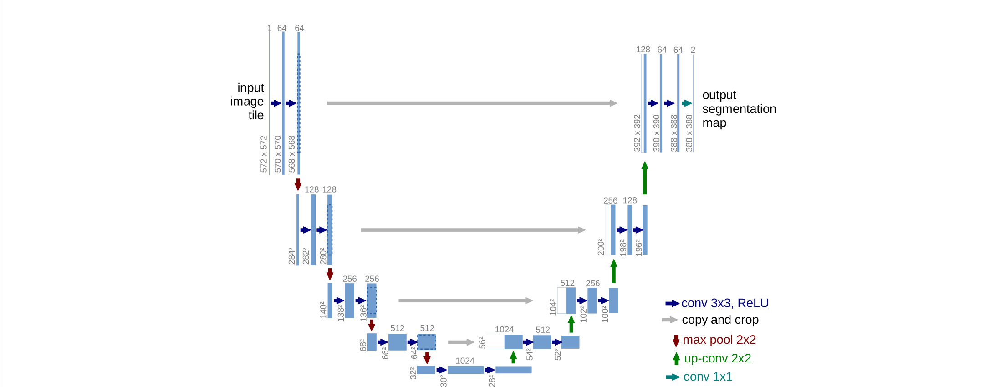
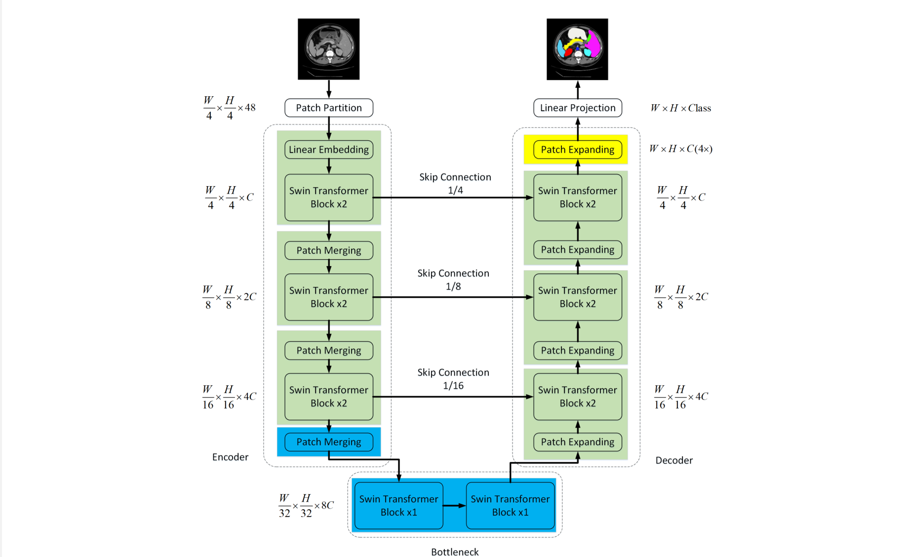
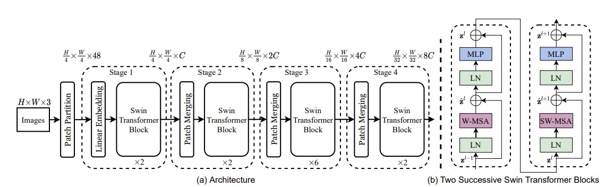

# Swin-Unet与Unet复现

Unet和Swin-Unet都是语义分割模型，网络结构都是一个类似于U型的编码器-解码器结构。前者是2015年提出的经典模型，全使用了卷积/反卷积操作；后者将这些操作全部改为Transformer。

[TOC]

# Unet

## 网络结构




左侧相当于编码器，右侧相当于解码器。左右各四个Stage。编码器进行四轮<u>卷积(RELU)-池化</u>操作，解码器进行四轮<u>卷积-上采样</u>操作。其中左侧每进行一次池化得到的特征图，与右侧对应的特征图进行拼接。

深层网络通过拼接的方式，有助于找回前面丢失的边缘特征。

## 代码复现

为了与Swin-Unet在相同数据集和条件下训练，适配输入224*224单通道图片。修改部分参数，Pytorch代码如下：

```python
class Unet(nn.Module):
    def __init__(self, num_classes=9):
        super(Unet, self).__init__()
        self.encoder = Encoder(in_channels=1)
        self.decoder = Decoder(num_classes)

    def forward(self, inputs):
        [feat1, feat2, feat3, feat4, feat5] = self.encoder(inputs)
        output = self.decoder(feat1, feat2, feat3, feat4, feat5)

        return output
        
# A VGG-like network, pure CNN
class Encoder(nn.Module):
    def __init__(self, in_channels):
        super(Encoder, self).__init__()
        self.features = nn.Sequential(
            nn.Conv2d(in_channels, 64, kernel_size=3, padding=1),
            nn.BatchNorm2d(64),
            nn.ReLU(inplace=True),

            nn.Conv2d(64, 64, kernel_size=3, padding=1),
            nn.BatchNorm2d(64),
            nn.ReLU(inplace=True),
            nn.MaxPool2d(kernel_size=2, stride=2),

            nn.Conv2d(64, 128, kernel_size=3, padding=1),
            nn.BatchNorm2d(128),
            nn.ReLU(inplace=True),

            nn.Conv2d(128, 128, kernel_size=3, padding=1),
            nn.BatchNorm2d(128),
            nn.ReLU(inplace=True),
            nn.MaxPool2d(kernel_size=2, stride=2),

            nn.Conv2d(128, 256, kernel_size=3, padding=1),
            nn.BatchNorm2d(256),
            nn.ReLU(inplace=True),

            nn.Conv2d(256, 256, kernel_size=3, padding=1),
            nn.BatchNorm2d(256),
            nn.ReLU(inplace=True),

            nn.Conv2d(256, 256, kernel_size=3, padding=1),
            nn.BatchNorm2d(256),
            nn.ReLU(inplace=True),
            nn.MaxPool2d(kernel_size=2, stride=2),

            nn.Conv2d(256, 512, kernel_size=3, padding=1),
            nn.BatchNorm2d(512),
            nn.ReLU(inplace=True),

            nn.Conv2d(512, 512, kernel_size=3, padding=1),
            nn.BatchNorm2d(512),
            nn.ReLU(inplace=True),

            nn.Conv2d(512, 512, kernel_size=3, padding=1),
            nn.BatchNorm2d(512),
            nn.ReLU(inplace=True),
            nn.MaxPool2d(kernel_size=2, stride=2),

            nn.Conv2d(512, 512, kernel_size=3, padding=1),
            nn.BatchNorm2d(512),
            nn.ReLU(inplace=True),

            nn.Conv2d(512, 512, kernel_size=3, padding=1),
            nn.BatchNorm2d(512),
            nn.ReLU(inplace=True),

            nn.Conv2d(512, 512, kernel_size=3, padding=1),
            nn.BatchNorm2d(512),
            nn.ReLU(inplace=True),
            nn.MaxPool2d(kernel_size=2, stride=2)
        )
        self._initialize_weights()

    def forward(self, x):
        # feature 1-4 is for copy-crop later, feature5 is the output
        feat1 = self.features[:6](x)
        feat2 = self.features[6:13](feat1)
        feat3 = self.features[13:23](feat2)
        feat4 = self.features[23:33](feat3)
        feat5 = self.features[33:-1](feat4)
        return [feat1, feat2, feat3, feat4, feat5]
    
class DecoderLayer(nn.Module):
    def __init__(self, in_size, out_size):
        super(DecoderLayer, self).__init__()
        self.conv1 = nn.Conv2d(in_size, out_size, kernel_size=3, padding=1)
        self.conv2 = nn.Conv2d(out_size, out_size, kernel_size=3, padding=1)
        self.up = nn.UpsamplingBilinear2d(scale_factor=2)
        self.relu = nn.ReLU(inplace=True)

    def forward(self, inputs1, inputs2):
        outputs = torch.cat([inputs1, self.up(inputs2)], 1)
        outputs = self.conv1(outputs)
        outputs = self.relu(outputs)
        outputs = self.conv2(outputs)
        outputs = self.relu(outputs)
        return outputs


class Decoder(nn.Module):
    def __init__(self, num_classes):
        super(Decoder, self).__init__()

        # upSampling
        # 64,64,512
        self.up_concat4 = DecoderLayer(1024, 512)
        # 128,128,256
        self.up_concat3 = DecoderLayer(768, 256)
        # 256,256,128
        self.up_concat2 = DecoderLayer(384, 128)
        # 512,512,64
        self.up_concat1 = DecoderLayer(192, 64)

        self.final = nn.Conv2d(64, num_classes, 1)

    def forward(self, feat1, feat2, feat3, feat4, feat5):
        up4 = self.up_concat4(feat4, feat5)
        up3 = self.up_concat3(feat3, up4)
        up2 = self.up_concat2(feat2, up3)
        up1 = self.up_concat1(feat1, up2)
        final = self.final(up1)

        return final
```

# Swin-Unet

## 网络结构



### 编码器

先对input图像进行`Patch Partition`，对应于代码里`PatchEmbed`类的实现，将图片切成patch_size*patch_size的图块，嵌入到`Embedding`

接三个Stage，每次先经过`Patch Merging`下采样，在行方向和列方向上间隔2选取元素（对应Unet里的卷积用来降低分辨率），然后经过两个`Swin Transformer`块。但是代码里的实现并不是按照图示这样分割的，它是将`Patch Partition`, `Linear Embedding`放在了前面开头，然后以“两个`Swin Transformer`块+`Patch Merging`”作为一个BasicLayer，将`Bottleneck`看做没有后接`Patch Merging`的BasicLayer。要是按着图示去复现，那Encoder跟官方代码肯定是长得非常不一样了。

最后再进行一次`Patch Merging`。连接编解码器的是`Bottleneck`，其实就是两个`Swin Transformer`块，此层图片大小不变。

### 解码器

上采样操作由`Patch Expanding`完成，每个Stage由上采样和两个`Swin Tranformer`块组成。但是代码里的实现并不是按照图示这样分割的，从下往上走，它将第一个Patch Expanding单独分出来，然后以“两个`Swin Transformer`块+`Patch Expanding`”作为一个BasicLayer_up，最后的`Patch Expanding`称为`FinalPatchExpand_X4`，是因为只有它是以4倍上采样。

左右每个Stage之间有跳跃连接，图示位置不明确；具体讲，是把编码器每个Stage进入BasicLayer前的输入，连接到解码器进入每个Stage前的输入。不过关于在哪里进行跳跃连接，作者的意思是“可以调整，不影响整体架构”。

### Swin Transformer



Swin-Unet的编码器部分就是Swin Transformer的结构，每两个Swin Tranformer块的结构如右b图。

**LN**：`LayerNorm`

**MLP**：带有GELU非线性的2层MLP

**W-MSA**：`Window Attention`，Transformer是基于全局来计算注意力的。而Swin Transformer将注意力的计算限制在每个窗口内，进而减少了计算量

**SW-MSA**：`Shifted Window Attention`，对特征图移位，并给Attention设置mask来实现和`Window Attention`相同的计算结果

我认为Swin-Unet是把Unet结构和Swin Transformer放在一起时自然而然产生的想法。因为Unet的主干网络本身就不一定是原本论文里的样子，可以是Resnet、VGG，可以是TransUnet这种CNN和Transformer结合的形态。关键还是在于有跳跃连接，而Swin Transformer又更加高效轻量，长程注意力也有很大优势。

## 代码复现

[引用自论文源仓库](https://github.com/HuCaoFighting/Swin-Unet)，结合自己的理解，写一下核心部分的代码：

```python
import torch
from torch import nn


def no_weight_decay():
    return {'absolute_pos_embed'}


def no_weight_decay_keywords():
    return {'relative_position_bias_table'}


def _init_weights(m):
    if isinstance(m, nn.Linear):
        trunc_normal_(m.weight, std=.02)
        if isinstance(m, nn.Linear) and m.bias is not None:
            nn.init.constant_(m.bias, 0)
    elif isinstance(m, nn.LayerNorm):
        nn.init.constant_(m.bias, 0)
        nn.init.constant_(m.weight, 1.0)


class Swin_Unet(nn.Module):
    def __init__(self, img_size, patch_size, in_channels, num_classes,
                 embed_dim, depths, num_heads,
                 window_size, mlp_ratio, qkv_bias, qk_scale,
                 drop_rate, attn_drop_rate, drop_path_rate):
        super().__init__()

        self.num_classes = num_classes
        self.num_layers = len(depths)
        self.embed_dim = embed_dim
        self.num_features = int(embed_dim * 2 ** (self.num_layers - 1))
        self.num_features_up = int(embed_dim * 2)
        self.mlp_ratio = mlp_ratio

        # patch partition 和 linear embedding

        # split image into non-overlapping patches
        self.patch_embed = PatchEmbed(
            img_size=img_size, patch_size=patch_size, in_channels=in_channels, embed_dim=embed_dim,
            norm_layer=nn.LayerNorm)
        patches_resolution = self.patch_embed.patches_resolution
        self.patches_resolution = patches_resolution
        # absolute position embedding，
        self.pos_drop = nn.Dropout(p=drop_rate)
        # stochastic depth
        dpr = [x.item() for x in torch.linspace(0, drop_path_rate, sum(depths))]

        # build encoderStages and bottleneck layers，每个BasicLayer包含两个Swin Transformer Block和一个下采样
        self.layers = nn.ModuleList()
        for i_layer in range(self.num_layers):
            layer = BasicLayer(dim=int(embed_dim * 2 ** i_layer),
                               input_resolution=(patches_resolution[0] // (2 ** i_layer),
                                                 patches_resolution[1] // (2 ** i_layer)),
                               depth=depths[i_layer],
                               num_heads=num_heads[i_layer],
                               window_size=window_size,
                               mlp_ratio=self.mlp_ratio,
                               qkv_bias=qkv_bias, qk_scale=qk_scale,
                               drop=drop_rate, attn_drop=attn_drop_rate,
                               drop_path=dpr[sum(depths[:i_layer]):sum(depths[:i_layer + 1])],
                               norm_layer=nn.LayerNorm,
                               downsample=PatchMerging if (i_layer < self.num_layers - 1) else None) # bottleneck没有下采样
            self.layers.append(layer)

        # build decoder layers，解码器每个Stage
        self.layers_up = nn.ModuleList()
        self.concat_back_dim = nn.ModuleList()
        for i_layer in range(self.num_layers):
            concat_linear = nn.Linear(2 * int(embed_dim * 2 ** (self.num_layers - 1 - i_layer)),
                                      int(embed_dim * 2 ** (
                                              self.num_layers - 1 - i_layer))) if i_layer > 0 else nn.Identity()
            if i_layer == 0:
                layer_up = PatchExpand(
                    input_resolution=(patches_resolution[0] // (2 ** (self.num_layers - 1 - i_layer)),
                                      patches_resolution[1] // (2 ** (self.num_layers - 1 - i_layer))),
                    dim=int(embed_dim * 2 ** (self.num_layers - 1 - i_layer)), dim_scale=2, norm_layer=norm_layer)
            else:
                layer_up = BasicLayer_up(dim=int(embed_dim * 2 ** (self.num_layers - 1 - i_layer)),
                                         input_resolution=(
                                             patches_resolution[0] // (2 ** (self.num_layers - 1 - i_layer)),
                                             patches_resolution[1] // (2 ** (self.num_layers - 1 - i_layer))),
                                         depth=depths[(self.num_layers - 1 - i_layer)],
                                         num_heads=num_heads[(self.num_layers - 1 - i_layer)],
                                         window_size=window_size,
                                         mlp_ratio=self.mlp_ratio,
                                         qkv_bias=qkv_bias, qk_scale=qk_scale,
                                         drop=drop_rate, attn_drop=attn_drop_rate,
                                         drop_path=dpr[sum(depths[:(self.num_layers - 1 - i_layer)]):sum(
                                             depths[:(self.num_layers - 1 - i_layer) + 1])],
                                         norm_layer=nn.LayerNorm,
                                         upsample=PatchExpand if (i_layer < self.num_layers - 1) else None)
            self.layers_up.append(layer_up)
            self.concat_back_dim.append(concat_linear)

        self.norm = nn.LayerNorm(self.num_features)
        self.norm_up = nn.LayerNorm(self.embed_dim)

        self.up = FinalPatchExpand_X4(input_resolution=(img_size // patch_size, img_size // patch_size),
                                      dim_scale=4, dim=embed_dim)
        self.output = nn.Conv2d(in_channels=embed_dim, out_channels=self.num_classes, kernel_size=1, bias=False)

        self.apply(_init_weights)

    # Encoder and Bottleneck
    def forward_features(self, x):
        x = self.patch_embed(x)
        if self.ape:
            x = x + self.absolute_pos_embed
        x = self.pos_drop(x)
        x_down_sample = []

        for layer in self.layers:
            x_down_sample.append(x)
            x = layer(x)

        x = self.norm(x)  # B L C

        return x, x_down_sample

    # Decoder and Skip connection
    def forward_up_features(self, x, x_down_sample):
        for inx, layer_up in enumerate(self.layers_up):
            if inx == 0:
                x = layer_up(x)
            else:
                x = torch.cat([x, x_down_sample[3 - inx]], -1)
                x = self.concat_back_dim[inx](x)
                x = layer_up(x)

        x = self.norm_up(x)  # B L C

        return x

    def up_x4(self, x):
        H, W = self.patches_resolution
        B, L, C = x.shape
        assert L == H * W, "input features has wrong size"

        x = self.up(x)
        x = x.view(B, 4 * H, 4 * W, -1)
        x = x.permute(0, 3, 1, 2)  # B,C,H,W
        x = self.output(x)

        return x

    def forward(self, x):
        x, x_down_sample = self.forward_features(x)
        x = self.forward_up_features(x, x_down_sample)
        x = self.up_x4(x)

        return x

    def flops(self):
        flops = 0
        flops += self.patch_embed.flops()
        for i, layer in enumerate(self.layers):
            flops += layer.flops()
        flops += self.num_features * self.patches_resolution[0] * self.patches_resolution[1] // (2 ** self.num_layers)
        flops += self.num_features * self.num_classes
        return flops

```

# 训练与推理

PyTorch 1.11.0 

Python 3.8(ubuntu20.04) 

Cuda 11.3

GPU：RTX 4090(24GB) * 1

CPU：22 vCPU AMD EPYC 7T83 64-Core Processor

内存：90GB

数据集：Synapse多器官分割

num_classes=9（0背景，1-8器官）

**Unet**：epoch=150，batch_size=16

**Swin-Unet**：epoch=150，batch_size=24（原论文）

很玄学，我这边换成2幂的batch_size，模型表现反而下降。

> Run the train script on synapse dataset. The batch size we used is 24. If you do not have enough GPU memory, the bacth size can be reduced to 12 or 6 to save memory.

测试集表现：使用Swin-Unet论文相同的指标Dice-Similarity coefficient (DSC↑) 和 average Hausdorff Distance(HD↓)

|               | DSC_avg   | HD_avg    | **1**     | **2**     | **3**     | **4**     | **5**     | **6**     | **7**     | **8**     |
| ------------- | --------- | --------- | --------- | --------- | --------- | --------- | --------- | --------- | --------- | --------- |
| **Swin-Unet** | **77.68** | **24.72** | 84.36     | 63.56     | 80.97     | **78.28** | **93.90** | **57.30** | **87.51** | **76.63** |
| **Unet**      | 77.17     | 28.55     | **87.37** | **66.79** | **82.92** | 73.79     | 92.97     | 55.62     | 84.63     | 73.23     |

复现结果来看，**Swin-Unet**的效果稍弱于论文，确实不太明白作者是怎么做到79.13的，如果显卡和随机种子不是关键因素的话，那最可能是因为论文实际上用了不一样的学习率策略。（我尝试了更多epoch到500，但并没有明显的提升，也没有明显的过拟合，所以学习率可能是影响因素）但是4090到期了，没钱继续炼了。

>  In our code, we carefully set the random seed, so the results should be consistent when trained multiple times on the same type of GPU. If the training does not give the same segmentation results as in the paper, it is recommended to adjust the learning rate.

而**Unet**的效果稍强于论文。

不过相对而言，**Swin-Unet**的优势是显而易见的。与论文相似，HD的下降了14%，在后面几个器官分类上，都有不小改进。

# 参考文献

1. [Cao, Hu et al. “Swin-Unet: Unet-like Pure Transformer for Medical Image Segmentation.” *ECCV Workshops* (2021).](https://arxiv.org/abs/2105.05537)
2. [Ronneberger, Olaf et al. “U-Net: Convolutional Networks for Biomedical Image Segmentation.” *ArXiv* abs/1505.04597 (2015): n. pag.](https://arxiv.org/abs/1505.04597)
3. [Liu, Ze et al. “Swin Transformer: Hierarchical Vision Transformer using Shifted Windows.” *2021 IEEE/CVF International Conference on Computer Vision (ICCV)* (2021): 9992-10002.](https://arxiv.org/abs/2103.14030)
